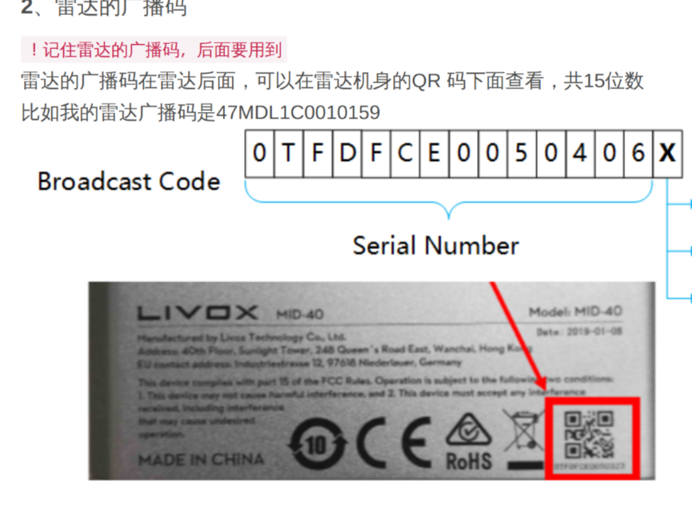
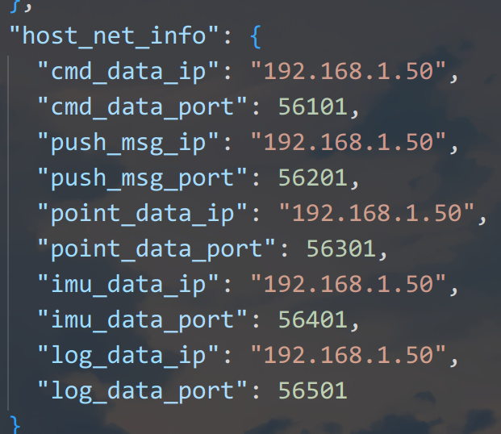
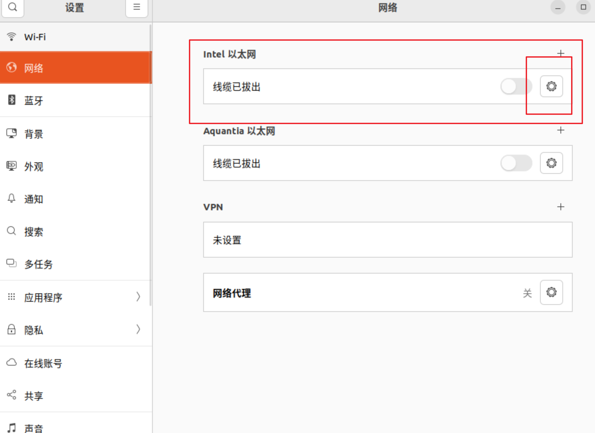
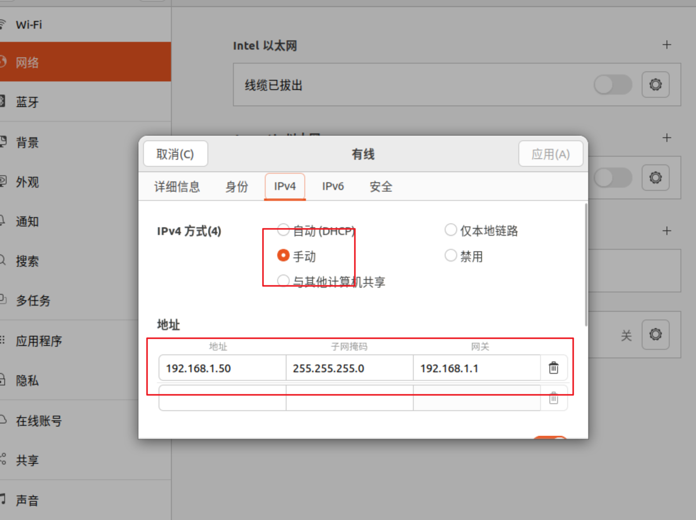

# MY_DRIVER

硬件驱动的整合包

## ch040_imu
启动ch040_imu命令
```
ros2 launch my_driver ch040_imu.launch.py
```
**PS：注意serial_port的权限问题，可能需要先给设备权限才能打开**
## hfi_imu
启动hfi_imu命令
```
ros2 launch my_driver imu.launch.py
```
**PS：这个launch启动的源文件不是简单的去找这个功能包下的这个文件名，而是去setup.py文件下寻找注册的节点用的是哪个文件**

上面的图的告诉的是去找robot_imu功能包下的hfi_a9_imu节点，不是找hfi_a9_imu文件，下面的图告诉这个节点对应的源文件是hfi_a9_ros.py


## 手柄 
启动手柄命令
```
ros2 launch my_driver joy.launch.py
```
启动了手柄转换节点并可以通过发布速度指令


## mid360 [仓库链接](https://github.com/Livox-SDK/livox_ros_driver2)


启动命令:
```bash
ros2 launch my_driver mid360_bringup.launch.py 
```
配置说明:
- launch调用同功能包config文件夹中的[MID360_config.json](./config/MID360_config.json)
- 下面的ip指的是雷达广播码



- 下面的ip指的是网口,需要调整`以太网中的ip`





## ms200线性雷达
启动命令:
```
ros2 launch my_driver ms200_scan.launch.py
```
**PS：USB设备注意串口号和权限**

## orbbec相机
启动命令：
```
ros2 launch my_driver orbbec_setup.launch.py
```

## realsense
启动命令：
```
ros2 launch my_driver realsense_bringup.launch.py
```
启动相机并且启动一个图像转换节点


## robosense airy

**必选项** 下面的ip指的是airy雷达需要配置本机的ip，否则接收不到雷达的消息

启动robosense并且启动一个imu坐标系转换节点，**本质是把imu的六轴数据转换到lidar坐标系下，跟tf没关系**

## d435i
启动命令：
```
ros2 launch my_driver usb_cam.launch.py
```
**源文件在，注意config文件里的设备名以及格式**

## wheel_imu
启动命令：
```
ros2 launch my_driver wheel_imu.launch.py
```
**端口号和设备权限**